# 🎮💻 Terminal Breach


> Jogo de adivinhação com narrativa hacker, análise estatística e aprendizado de algoritmos — desenvolvido em C puro para terminal.

---

## 🎮💻 Sobre o Projeto

**Terminal Breach** é um jogo educativo desenvolvido como projeto acadêmico na CESAR School.

O jogador assume o papel de um hacker tentando descobrir o código de acesso de um servidor protegido por firewall. A cada tentativa, o sistema fornece feedback temático (scanning, intrusão, recuo), criando uma experiência imersiva.

Ao final da sessão, o jogo gera um **relatório de auditoria completo**, contendo:

* 📊 Estatísticas de desempenho
* 🧠 Sugestões de estratégia
* 🏆 Rating personalizado

O projeto aborda conceitos fundamentais da linguagem C, como:

* geração de números aleatórios (`srand(time)`)
* recursão
* manipulação de arquivos
* estruturas de controle
* lógica algorítmica

---

## ⚙️ Funcionalidades

* 🎲 Geração de número aleatório por sessão com seed por timestamp
* 🔁 Loop de tentativas com dicas narrativas temáticas
* 🎯 Quatro níveis de dificuldade (Script Kiddie, Hacker, Elite, Ghost)
* 📝 Registro automático em `audit_log.txt`
* 📊 Relatório com média, desvio padrão, melhor e pior sessão
* 🧠 Estatísticas implementadas com recursão
* 💡 Sugestões de estratégia baseadas no padrão do jogador
* 🏆 Sistema de rating por sessão
* 📈 Leaderboard dos melhores jogadores
* 👻 Modo Fantasma (busca binária automática)

---

## 🗂️ Estrutura do Projeto

```bash
terminal-breach/
├── src/
│   ├── game.c          # loop principal e lógica da sessão
│   ├── rng.c           # geração de número aleatório
│   ├── logger.c        # manipulação do audit_log.txt
│   ├── stats.c         # estatísticas com recursão
│   ├── advisor.c       # sugestões de estratégia
│   └── ranking.c       # leaderboard
├── include/
├── docs/
│   ├── board.png
│   └── backlog.png
├── audit_log.txt
├── Makefile
└── README.md
```

---

## 🚀 Como Executar

### 🔧 Pré-requisitos

* GCC instalado (Linux, macOS ou WSL)

### ▶️ Execução

```bash
# Clonar o repositório
 https://github.com/MateusDS-dev/Terminal_Breach.git

# Entrar na pasta
cd terminal_breach

# Compilar
make

# Executar
./terminal_breach

# Executar modo fantasma
./terminal_breach --ghost
```

---

## 👥 Equipe

| Papel           | Nome                         | Responsabilidades                                                                   |
| --------------- | ---------------------------- | ----------------------------------------------------------------------------------- |
| 👑 Líder        | Rafael Medeiros Machado Dias | Coordenação geral, integração dos módulos, Modo Fantasma (busca_binaria_rec), TB-10 |
| ⚙️ Back-end     | Cauã Henrique Melo Almeida   | RNG (`rng.c`), logs (`logger.c`), TB-01, TB-03                                      |
| 🎨 Front-end    | João Felipe Bonifácio Barros | Loop principal (`game.c`), níveis e rating, TB-02, TB-07, TB-08                     |
| 📊 Estatísticas | Luis Henrique Vilas Boas     | Recursão e análise (`stats.c`, `advisor.c`), TB-04, TB-05, TB-06                    |
| 🧪 QA/Testes    | Mateus Henrique Diniz Silva  | Ranking (`ranking.c`), testes e validações, TB-09                                   |

---

## 📌 Backlog — Histórias de Usuário (Detalhado)

As histórias seguem o padrão **3Cs (Cartão, Conversa, Confirmação)**.

---

### 🔴 Prioridade 1 — MVP

### TB-01 · Geração de número aleatório
> Como jogador, quero que o jogo gere um número secreto diferente a cada sessão, para que a experiência seja imprevisível.

**Critérios:**
* Número entre 1 e 100 usando `srand(time)`
* Não repete na mesma execução
* Validado em múltiplas execuções

**Diagrama:**
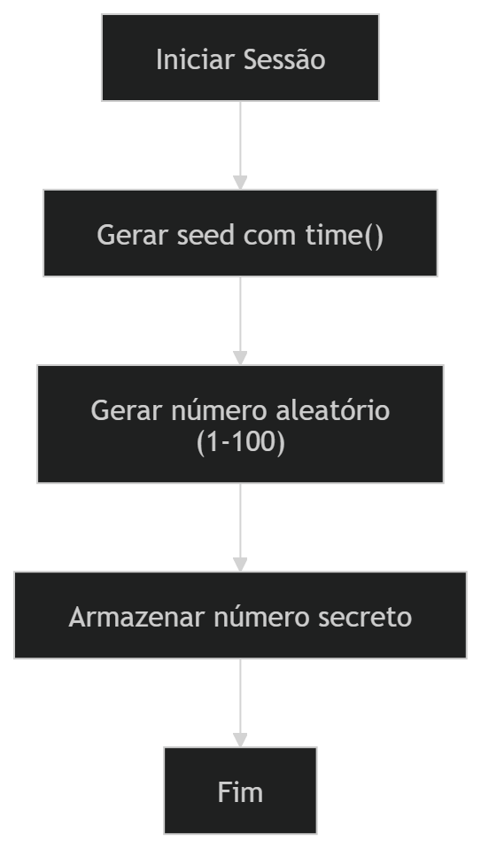

---

### TB-07 · Níveis de dificuldade
* Script Kiddie, Hacker, Elite, Ghost
* Configuração inicial
* Registro no log

**Diagrama:**


---

### TB-02 · Loop com dicas temáticas
> Como jogador, quero receber feedback imersivo ao errar tentativas.

**Critérios:**
* Mensagens para alto/baixo
* Mostra tentativas restantes
* Encerra corretamente

**Diagrama:**
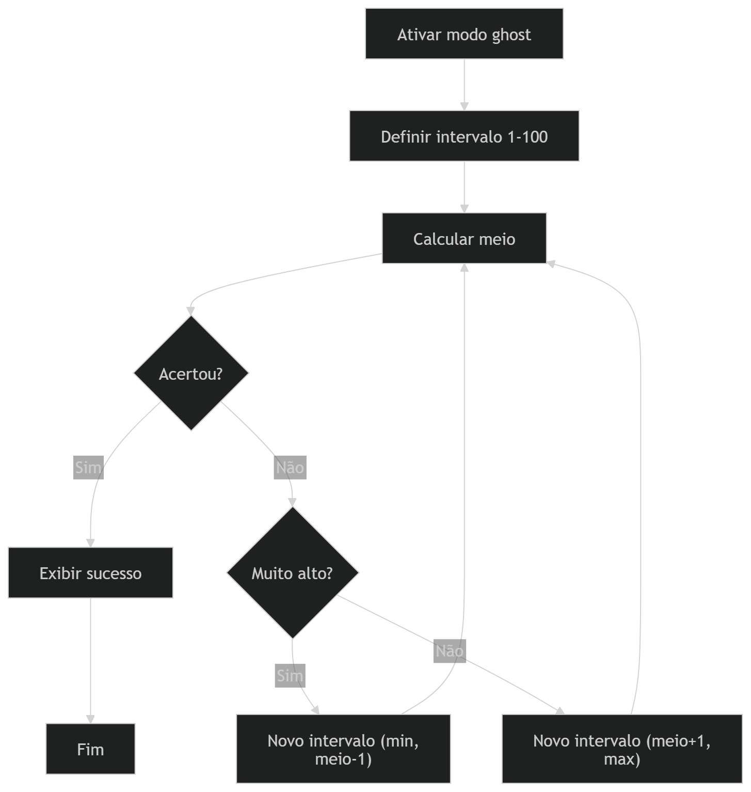

---

### 🟡 Prioridade 2

### TB-06 · Sugestões de estratégia
> Como jogador, quero melhorar minha eficiência.

**Critérios:**
* Detecta padrões
* Sugere melhorias
* Exibe no final

**Diagrama:**
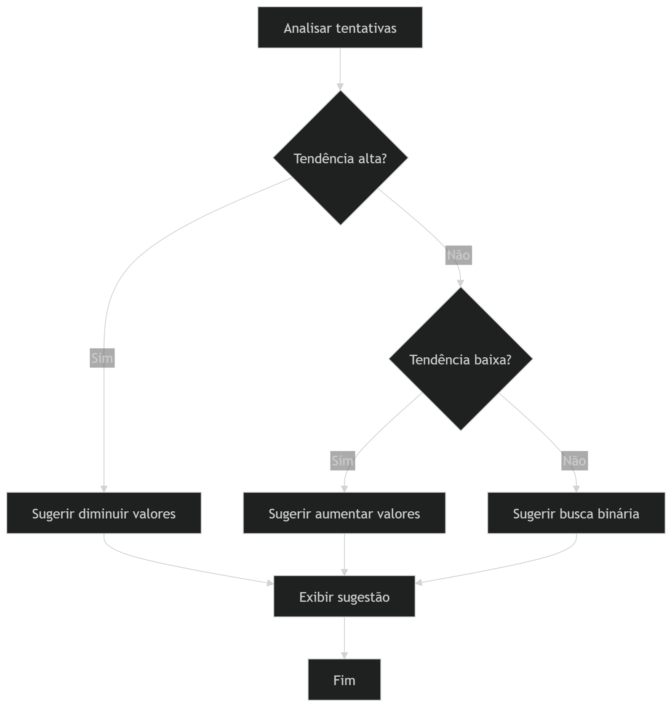

---

### TB-08 · Sistema de rating
* Baseado em eficiência
* Exibição temática
* Salvo no log

**Diagrama:**
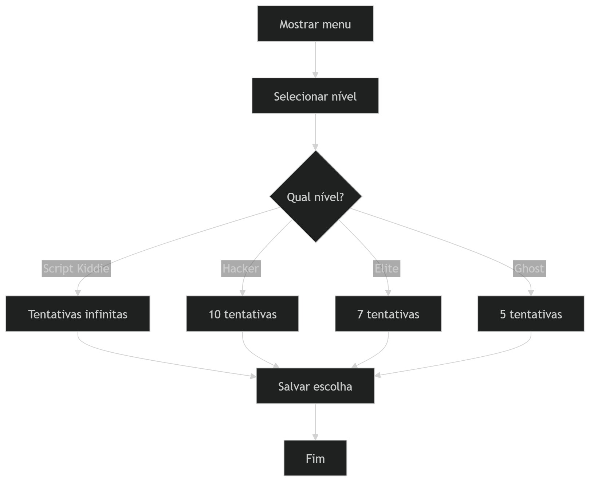

---

### 🟢 Prioridade 3

### TB-03 · Registro em log
> Como jogador, quero histórico das partidas.

**Critérios:**
* Cria `audit_log.txt`
* Salva dados completos
* Usa modo append

**Diagrama:**
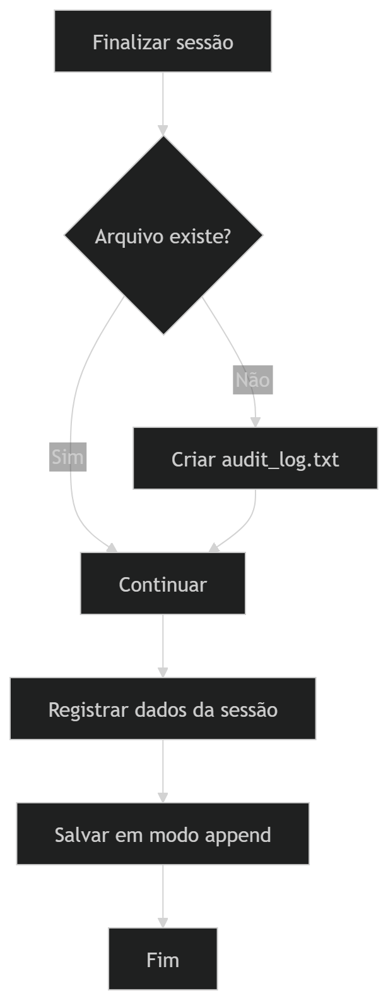

---

### TB-04 · Média de desempenho
> Como jogador, quero entender minha performance.

**Critérios:**
* Lê o arquivo
* Calcula média correta
* Exibe no relatório

**Diagrama:**
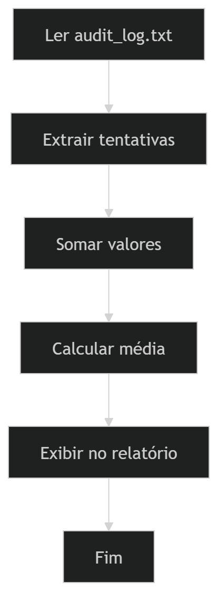

---

### TB-05 · Estatísticas com recursão
> Como estudante, quero aplicar recursão em problemas reais.

**Critérios:**
* Funções recursivas implementadas
* Resultado correto
* Código comentado

**Diagrama:**
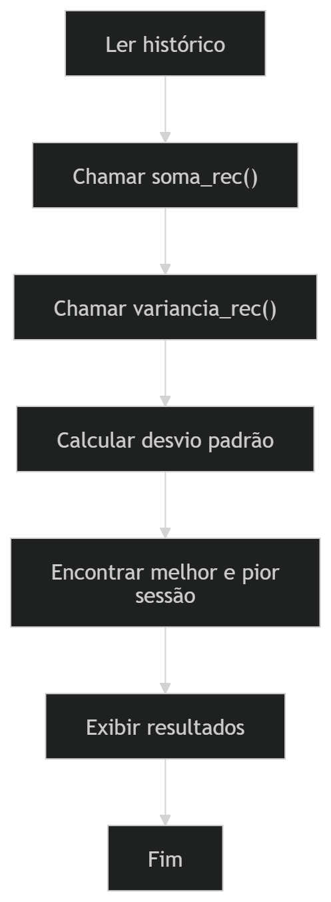

---

### TB-09 · Leaderboard
* Ordenação por desempenho
* Top 5 jogadores
* Exibição formatada

**Diagrama:**
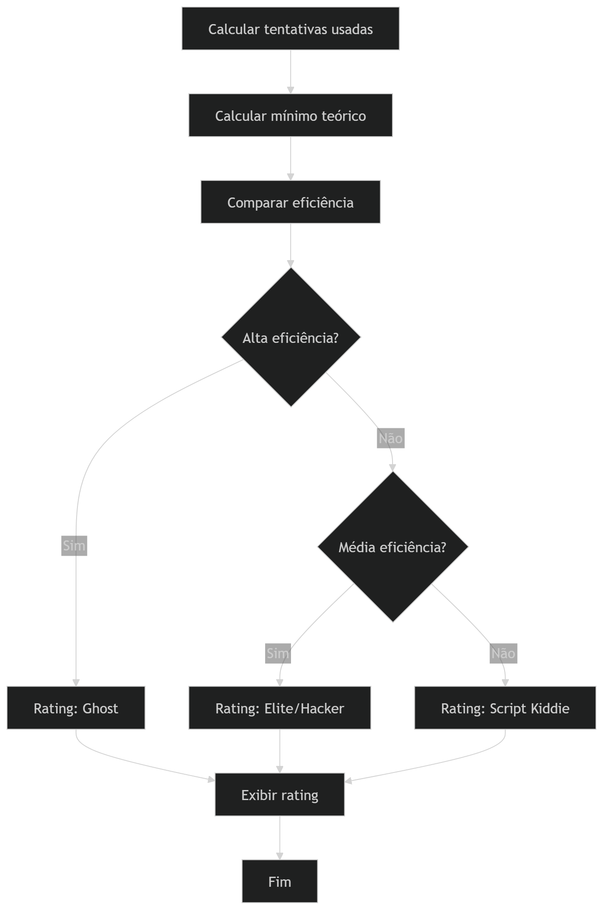

---

### ⭐ Extra

### TB-10 · Modo Fantasma
* Busca binária recursiva
* Execução automática
* Explicação passo a passo

**Diagrama:**
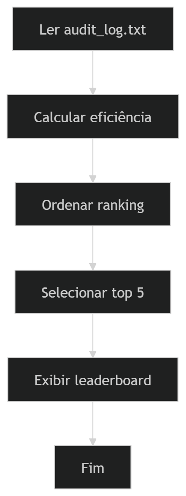

---

## 📸 Board do Projeto

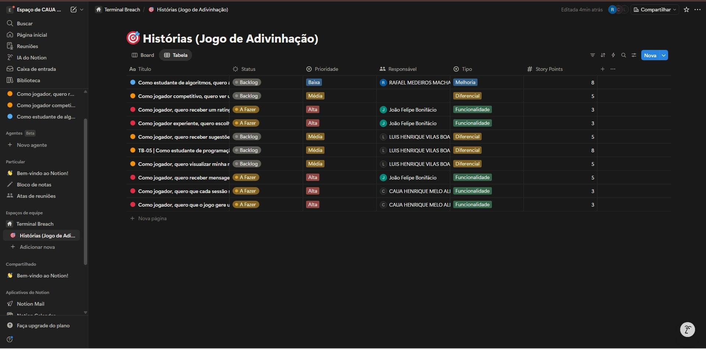

---

## 📸 Backlog Visual

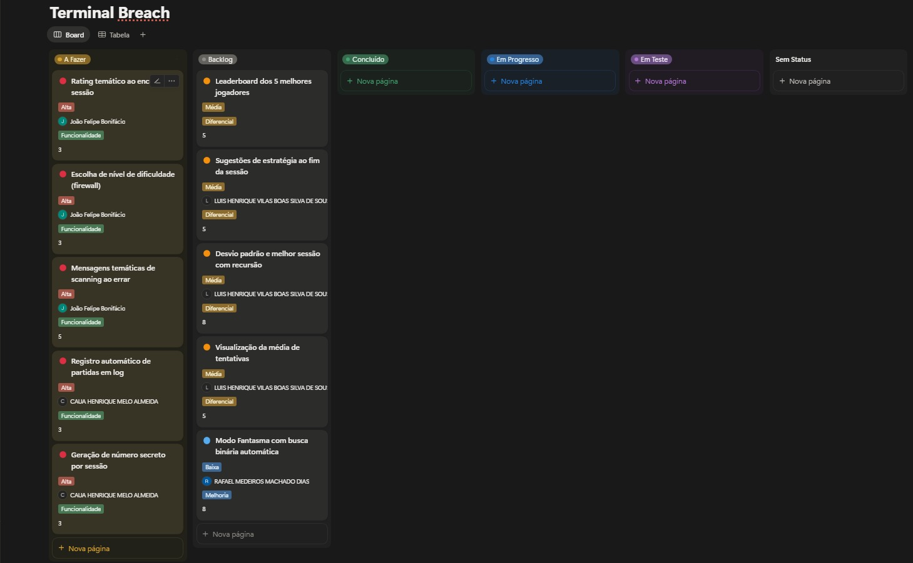

---

## 📱 Protótipo Lo-Fi (Figma)

O protótipo de baixa fidelidade foi desenvolvido utilizando o Figma, representando as principais telas do sistema.


---

## 📝 Sketches e Storyboards

Abaixo estão as representações visuais das histórias de usuário (mínimo de 10):

### 🎮  ·tela inicial
Entrada do sistema, apresentação e botão “Iniciar invasão”
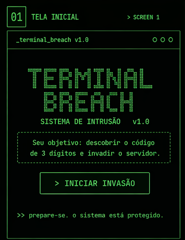

### 🎮 · Seleção de Dificuldade
Escolha do nível (Script Kiddie, Hacker, Elite, Ghost)
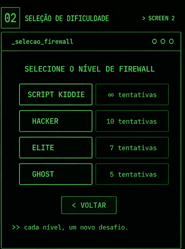

### 🎮  ·Jogo / Tentativa
Onde o jogador digita o código e tenta invadir
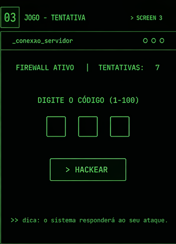

### 🎮  · Feedback da Tentativa
Resposta do sistema (ex: muito alto / muito baixo)
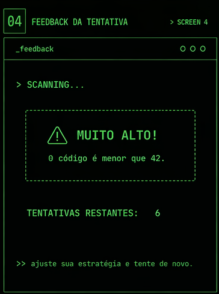

### 🎮  ·Relatório de Auditoria
Estatísticas do jogador (média, desempenho, etc.)
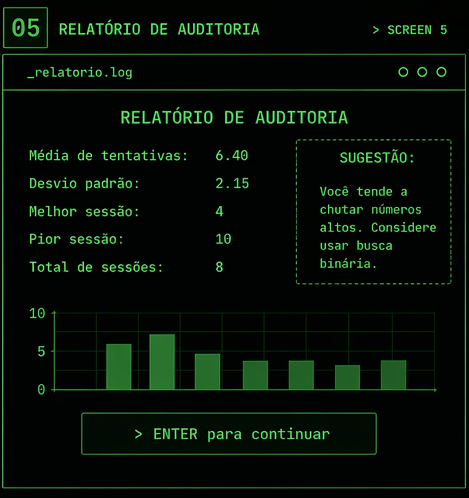

### 🎮 .Leaderboard
Ranking dos melhores jogadores
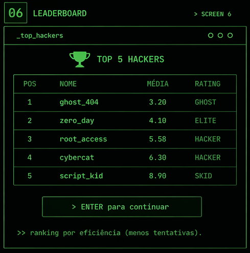

### 🎮 ·Modo Fantasma (Busca Binária)
Demonstração automática usando busca binária
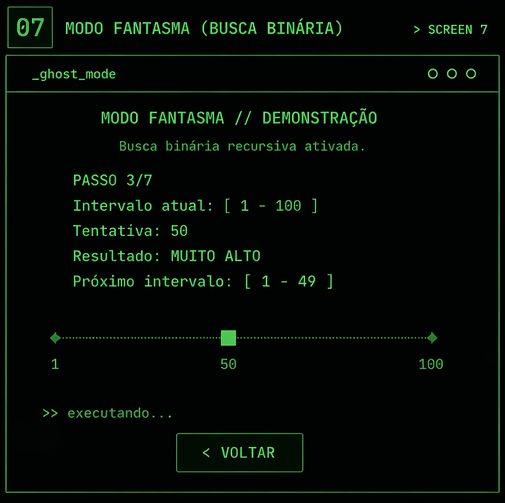

---

## 🎥 Screencast do Protótipo

Veja a demonstração do protótipo em funcionamento:

https://youtube.com/shorts/lO7e-riMUbg?si=E5R2xM5VOt1JLnki


## 📚 Observações Acadêmicas

Projeto desenvolvido para a disciplina de Desenvolvimento de Software Prático — CESAR School.

Abrange:

* programação imperativa
* recursão
* manipulação de arquivos
* análise estatística

A funcionalidade extra implementa **busca binária recursiva**, permitindo visualizar o algoritmo em execução.

---
